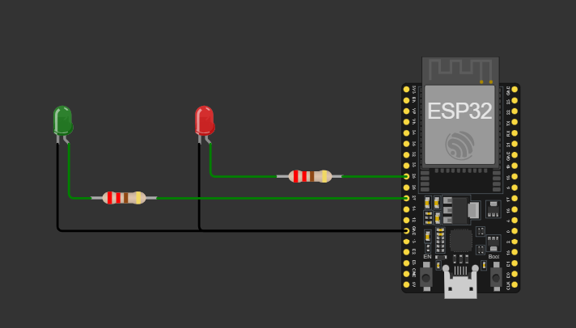
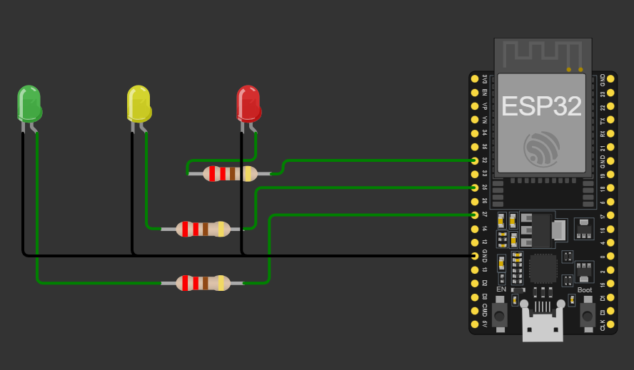
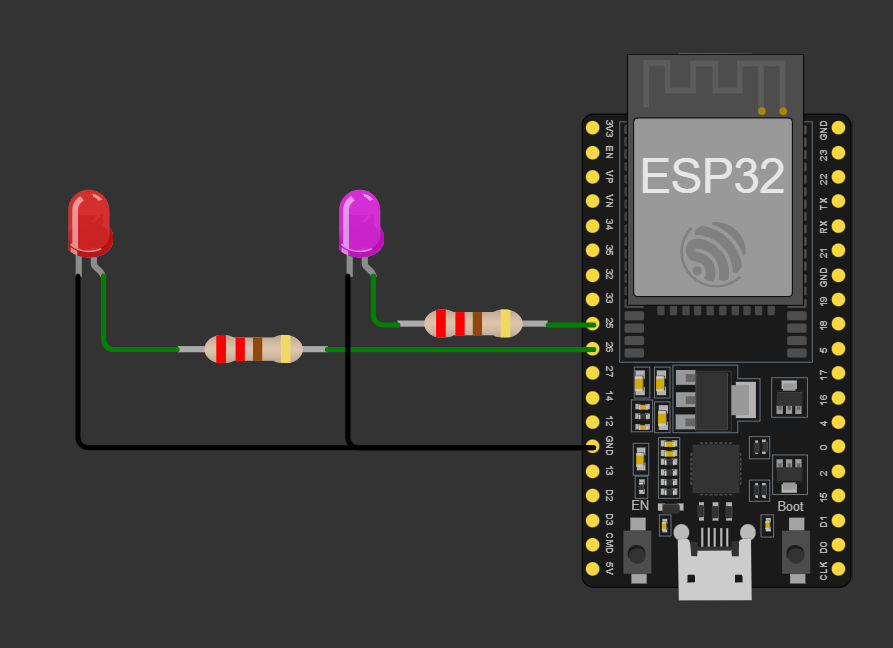
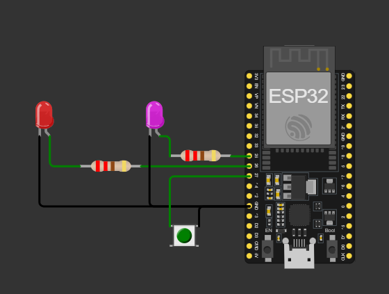

# Internet das Coisas (IoT)

## 📚 Sobre a Unidade Curricular

Nesta unidade, você aprenderá os fundamentos da Internet das Coisas (IoT), explorando a programação de dispositivos conectados, sensores e atuadores, além de protocolos de comunicação IoT.

## 🎯 Competências Desenvolvidas

- Conceitos básicos de IoT
- Programação de dispositivos conectados
- Uso de sensores e atuadores
- Protocolos de comunicação IoT (MQTT)

## 🛠️ Tecnologias Utilizadas

- Microcontroladores (ESP32)
- Protocolos MQTT e HTTP
- Sensores e atuadores
- Ferramentas de simulação IoT

## 📅 Atividades

- Configuração de dispositivos IoT
- Desenvolvimento de projetos práticos com sensores e atuadores
- Implementação de comunicação entre dispositivos
- Integração com plataformas na nuvem

## 📂 Projetos Desenvolvidos

Aqui estão os projetos que estamos desenvolvendo nesta unidade curricular:

---

1. **Pisca LED**

   - Descrição: Um projeto simples para alternar o estado de dois LEDs.
   - Imagem:
     

     
     

---

2. **Semáforo**

   - Descrição: Simulação de um semáforo com LEDs vermelho, amarelo e verde.
   - Imagem:
     

     
     

---

3. **Exemplo com Millis**

   - Descrição: Demonstração do uso da função `millis` para controle de tempo sem bloquear o programa.
   - Imagem:
     

     
     

---

4. **Exemplo com Millis 2**

   - Descrição: Outro exemplo utilizando `millis` para controle avançado de tempo.
   - Imagem:
     

     
     

---
