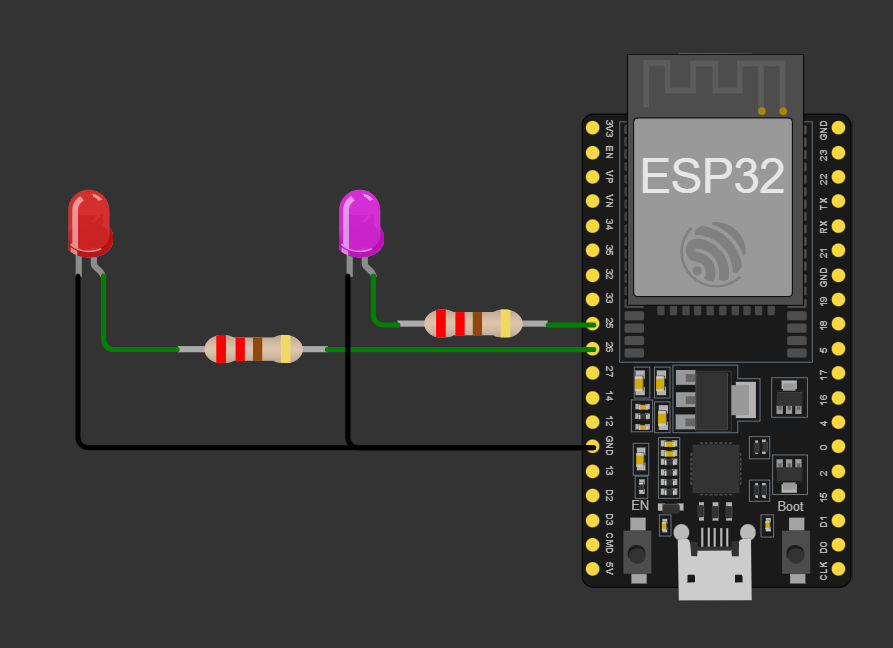
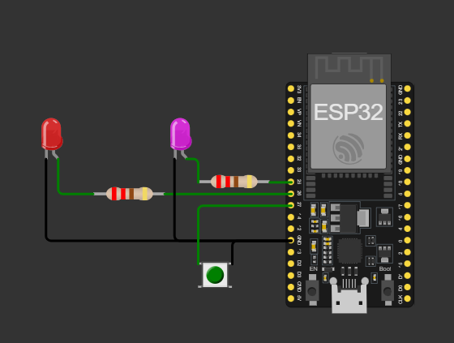
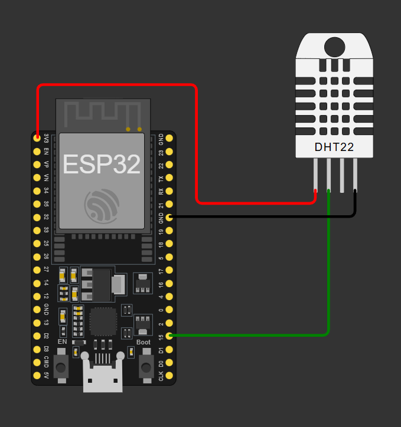
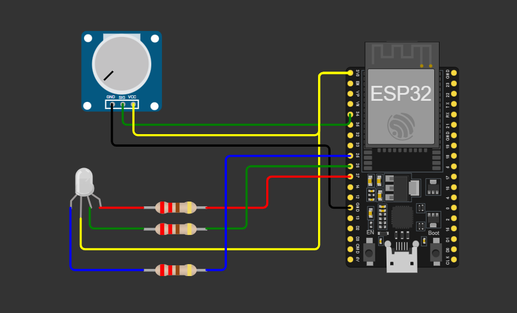
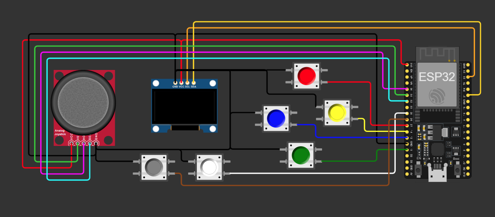

# Internet das Coisas (IoT)

## 📚 Sobre a Unidade Curricular

Nesta unidade, você aprenderá os fundamentos da Internet das Coisas (IoT), explorando a programação de dispositivos conectados, sensores e atuadores, além de protocolos de comunicação IoT.

## 🎯 Competências Desenvolvidas

- Conceitos básicos de IoT
- Programação de dispositivos conectados
- Uso de sensores e atuadores
- Protocolos de comunicação IoT (MQTT)

## 🛠️ Tecnologias Utilizadas

- Microcontroladores (ESP32)
- Protocolos MQTT e HTTP
- Sensores e atuadores
- Ferramentas de simulação IoT

## 📅 Atividades

- Configuração de dispositivos IoT
- Desenvolvimento de projetos práticos com sensores e atuadores
- Implementação de comunicação entre dispositivos
- Integração com plataformas na nuvem

---

## 📂 Projetos Desenvolvidos

Aqui estão os projetos que estamos desenvolvendo nesta unidade curricular:

---

1. **Pisca LED**

   - Descrição: Um projeto simples para alternar o estado de dois LEDs.
   - Código: [01_Pisca_Led.ino](./01_Pisca_Led.ino)
   - Imagem:
     

     
     

---

2. **Semáforo**

   - Descrição: Simulação de um semáforo com LEDs vermelho, amarelo e verde.
   - Código: [02_Semaforo.ino](./02_Semaforo.ino)
   - Imagem:
     

     
     

---

3. **Função Millis**

   - Descrição: Demonstração do uso da função `millis` para controle de tempo sem bloquear o programa.
   - Código: [03_Funcao_Millis.ino](./03_Funcao_Millis.ino)
   - Imagem:
     

     
     

---

4. **Millis com Interrupção**

   - Descrição: Exemplo utilizando `millis` com interrupção para controle avançado de tempo.
   - Código: [04_Millis_Interrupcao.ino](./04_Millis_Interrupcao.ino)
   - Imagem:
     

     
     

---

5. **Sensor DHT22 - Temperatura e Umidade**

   - Des crição: Projeto para leitura de temperatura e umidade utilizando o sensor DHT22, com exibição dos dados no monitor serial.
   - Código: [05_DHT22_Temperatura_Umidade.ino](./05_DHT22_Temperatura_Umidade.ino)
   - Imagem:
     

     
     

---

6. **LED RGB com Potenciômetro**

   - Descrição: Controle de LED RGB utilizando potenciômetros para ajustar as cores (vermelho, verde e azul) de forma independente.
   - Código: [06_LED_RGB_Potenciometro.ino](./06_LED_RGB_Potenciometro.ino)
   - Imagem:
     

     
     

---

7. **Joystick com Display OLED e Botões**

   - Descrição: Projeto que utiliza um joystick e botões para interagir com um display OLED, exibindo mensagens e direções do joystick.
   - Código: [07_Joystick_Display_Oled_Botoes.ino](./07_Joystick_Display_Oled_Botoes.ino)
   - Imagem:
     

     
     

---
